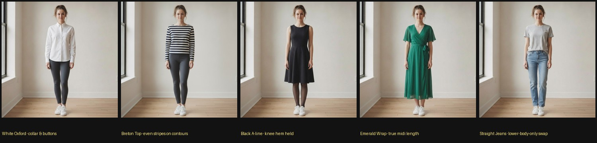
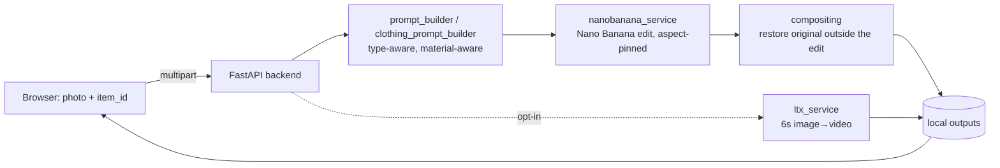
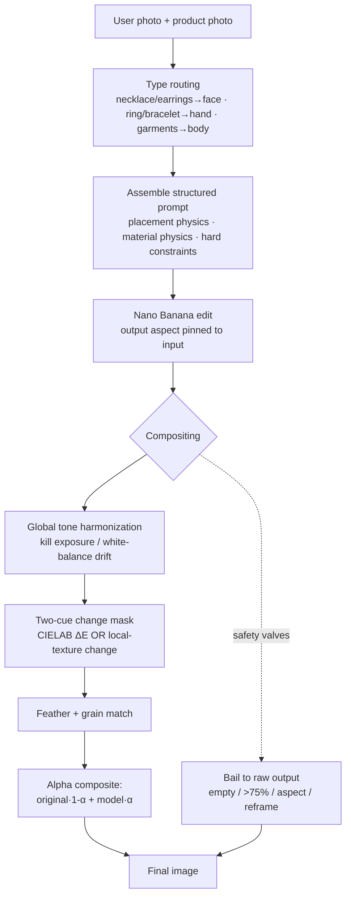

# Jewelry & Clothing Virtual Try-On — with a pixel-preserving realism pipeline

Upload one photo, pick an item, and get a **photorealistic** try-on: jewelry on
a face/hand, or a full outfit on a body. Built on **Nano Banana**
(`gemini-3.1-flash-image`) for the edit and a **computational-photography
post-stage** that keeps the result a *photograph of you* — not an AI re-render
of you.

> Originally the Sixth Dimension Labs backend assignment (Part 1 jewelry, Part 2
> clothing bonus). It then became a multi-iteration study in *how far you can
> push virtual-try-on realism on top of a single image-editing model* — with
> every claim measured, every failed idea documented, and every preserved pixel
> provably original.



*The five catalog garments, each a real try-on of the same synthetic person — a
crisp Oxford, a striped Breton knit, a knee-length A-line, an emerald wrap midi
at its true length, and a lower-body-only jeans swap. Identity and background are
the original photo's pixels in every frame. (The harder adversarial garments —
satin gowns, bubble hems, sequins, sheer mesh — are exercised by the
[stress benchmark](#the-adversarial-benchmark); their reference images are
user-sourced and not redistributed here.)*

---

## Table of contents

- [What it does](#what-it-does)
- [Why this is hard](#why-this-is-hard)
- [Architecture](#architecture)
- [The pipeline](#the-pipeline)
- [The realism journey](#the-realism-journey-the-interesting-part) ← the interesting part
- [Pixel-preserving compositing](#pixel-preserving-compositing)
- [Prompt engineering](#prompt-engineering)
- [Evaluation methodology](#evaluation-methodology)
- [The adversarial benchmark](#the-adversarial-benchmark)
- [Results](#results)
- [Honest limitations](#honest-limitations)
- [Roadmap](#roadmap)
- [Setup & run](#setup--run)
- [Repo layout](#repo-layout)
- [Credits](#credits--licensing)

---

## What it does

| Item types | Photo needed | Example |
| --- | --- | --- |
| Necklaces, earrings | a **face** (head & shoulders) photo |  |
| Rings, bracelets | a **hand / wrist** photo |  |
| Tops, dresses, skirts, jackets, trousers, two-piece sets | a **full-body** photo |  |

1. A **type-aware prompt** is assembled in code (never a static string) and sent
   to Nano Banana with the user photo + product photo.
2. The model's output is run through a **pixel-preserving compositor** that
   restores the original photograph everywhere except the edited region.
3. Optionally, a **6-second LTX 2.3 video** animates the result (opt-in; billed
   per second).

Everything runs locally (FastAPI + a no-framework HTML/JS frontend) and writes
only to the local filesystem. The exact prompt used is inspectable in the UI.

---

## Why this is hard

A convincing try-on is not "paste the object on." A human notices, instantly and
at a glance:

- **Floating objects** — jewelry with no contact shadow reads as a sticker.
- **Identity drift** — "that's *almost* me" is worse than a stranger.
- **Material tells** — flat sequins, plastic satin, opaque "sheer" fabric, garbled embroidery.
- **Background / grain / exposure drift** — the edit is clean but the rest of the photo subtly changed.
- **Geometry** — hems past the knee, erased legs, symmetry forced onto an asymmetric garment.

The core tension: **diffusion image-editors re-synthesize the entire frame.**
Even a perfect prompt cannot make them return your original pixels — so the face,
hair, background and grain all drift a little. That single fact shaped the whole
architecture.

---

## Architecture



| Layer | Choice |
| --- | --- |
| Backend | Python, FastAPI, Uvicorn, Pydantic |
| Image try-on | **Nano Banana** — `gemini-3.1-flash-image` default (REST); `gemini-3-pro-image` optional |
| Compositing | numpy + scipy + Pillow (CIELAB diff-mask, feathered alpha, grain/tone match) — no new model, no GPU |
| Video | LTX 2.3 (`ltx-2-3-fast`), synchronous image→video |
| Frontend | Plain HTML / CSS / JS — no frameworks |
| Config | `python-dotenv` — nothing hardcoded, secrets only in `.env` |
| Tests | pytest — **112 tests** |
| Evaluation | golden benchmark + adversarial stress harness + offline compositing A/B, all Pillow/numpy |

---

## The pipeline



The compositor is the difference between "a good generation" and "a photograph
of *this* person." Outside a tight, feathered edit region, **every pixel is the
original upload** — so identity, hair, background, lens character and film grain
cannot drift.

---

## The realism journey (the interesting part)

This project's value is the *method*: each stage was driven by a measured
failure, and ideas that didn't measurably help were deleted. Full write-up:
**[eval/REALISM_AUDIT.md](eval/REALISM_AUDIT.md)**.

### 1 · Prompt v1 → v2 — fix the gross failures
The first benchmark exposed two hard failures: a midi dress drifting to
floor-length and **erasing the wearer's legs**, and an earring silently
**omitted under hair**. v2 added body-landmark hem constraints, a visible-skin
conservation rule, strict earring-occlusion rules, scale anchors, and a
"photographic-character" section. Both failures fixed, benchmark-verified.
→ [eval/BENCHMARK_RESULTS.md](eval/BENCHMARK_RESULTS.md)

### 2 · The diagnosis — *why* it still looked synthetic
A zoom-level audit of a full 15-case sweep measured the root cause: the API path
**re-synthesizes every pixel** — "untouched" walls and faces lost 12–19% of their
micro-texture, faces read as "sisters, not the same woman." Classified every
remaining tell (missing contact shadows, no environmental colour in metal, hair
depth-ordering, chiffon-rendered-as-jersey) by origin — prompt / asset / input /
eval / model / architecture — and concluded: **prompts are no longer the
bottleneck.** It ranked a roadmap; the compositor was #1.
→ [eval/REALISM_AUDIT.md](eval/REALISM_AUDIT.md) (diagnosis)

### 3 · The compositor — keep the model's edit, restore the photo
Because the aspect-pinned output is already pixel-registered to the input
(median per-pixel diff ≈ 2, the JPEG floor), a difference mask cleanly isolates
the edit. Restoring original pixels outside it collapsed background drift from
~2.0 to ~0.15 and removed exposure/grain drift entirely — measured, not asserted.

| Before (raw model) → after (composite). The diff column is the proof: raw changes the **whole person**; the composite changes **only the jewelry**. |
| --- |
|  |
|  |

### 4 · The adversarial sprint — break clothing on purpose
A 21-garment stress set (sequins, satin, sheer mesh, corsets, structured
outerwear, bubble hems, asymmetry, skirts) exposed taxonomy and material gaps.
Outcome: an **expanded garment taxonomy** (skirt / jacket / set, plus a
"worn-over" layering mode), **material-aware prompting**, and a **two-cue change
mask**. 20/21 generated convincingly; the one refusal was a content-policy block
on a revealing cut-out, not a pipeline bug.
→ [eval/REALISM_AUDIT.md](eval/REALISM_AUDIT.md) (Part II)

### 5 · The optimization re-audit — try to disprove everything
A fresh review attacked the dominant remaining jewelry tell ("floating / weak
contact shadows") **three ways** — a strengthened prompt, deterministic
contact-shadow synthesis, and a model self-refinement pass — and **rejected all
three** because none beat the measurable + no-regression bar (the refinement's
contact shadow was within ±1 luma of noise). The one lever that *did* move
realism was a stronger model, `gemini-3-pro-image` — which also reframes
unpredictably, so a **background-reframe guard** was added to make it safe to opt
into.
→ [eval/REALISM_AUDIT.md](eval/REALISM_AUDIT.md) (Part III)

---

## Pixel-preserving compositing

[`backend/services/compositing.py`](backend/services/compositing.py) — on by
default (`TRYON_COMPOSITE=1`), numpy/scipy/Pillow only.

1. **Tone harmonization** — fit a per-channel gain+bias on the unchanged majority of pixels to neutralize the model's global exposure / white-balance drift.
2. **Two-cue change mask** — `CIELAB ΔE` **OR** local-texture change → de-speckle → fill holes → dilate (the dilation keeps the model's contact shadow). The texture cue catches edits whose *colour* resembles what they replaced (recall 0.61 → 0.75 in a controlled test; ~1.0 when texture differs).
3. **Feather + grain match** — soft alpha boundary; re-inject sensor noise into the denoised edit region to match the surrounding grain.
4. **Composite** — `original·(1−α) + harmonized·α`.

**Identity is preserved by construction** — the face is outside the mask, so its
pixels are literally the original. **Safety valves** bail to the raw output when
the mask is empty, covers >75% of the frame, the aspect ratio changed, or the
**background structurally drifted** (a within-aspect reframe) — so the
post-process can never do worse than the model alone.

---

## Prompt engineering

Prompts are **assembled by code per request**, never static
([`prompt_builder.py`](backend/services/prompt_builder.py),
[`clothing_prompt_builder.py`](backend/services/clothing_prompt_builder.py)):

- **Role + explicit image naming** ("Image 1 = the person, Image 2 = the product") — kills the most common multi-image failure.
- **Product anchor** — name, type, description, and per-item hints injected from the catalog so the model reproduces *this* piece.
- **Placement / fit physics** — per type: necklaces drape to the collarbones; earrings attach at both lobes and obey gravity; rings wrap the finger's cylinder; garments get hem landmarks and a visible-skin rule.
- **Garment taxonomy** — `top · dress · trousers · skirt · jacket · set`, with a `layer:"over"` mode so **outerwear is worn over the existing clothing** instead of replacing it (a skirt no longer grows trouser legs; a jacket no longer deletes the tee).
- **Material-aware physics (keyword-triggered, additive)** — sequins ("each disc is a tiny mirror reflecting the same scene lights"), satin (anisotropic sheen), sheer ("skin stays visible through it"), beading, feathers, metal hardware, ombré, bubble hems. Plain garments match nothing and don't regress.
- **Hard constraints** — a reject-list: photorealistic, no pasted-on look, no identity/background/framing change, no style-transfer, single output.

---

## Evaluation methodology

Realism is **measured, not asserted**. Four complementary harnesses, all
Pillow/numpy, none touching the (paid) video API:

| Harness | What it does |
| --- | --- |
| [`eval/run_eval.py`](eval/run_eval.py) | Golden benchmark — pairs every catalog item with a fixed synthetic input; scores aspect drift, background preservation, noise/sharpness parity, brightness drift, lower-body skin conservation; writes reports + a human-rubric column. |
| [`eval/stress_eval.py`](eval/stress_eval.py) | Adversarial sweep — runs the 21 hard garments end-to-end, emits comparison + diff panels and edit-region-aware metrics. |
| [`eval/compositing_eval.py`](eval/compositing_eval.py) | Offline A/B — runs the compositor on committed model outputs (no API spend) and tabulates the before/after metric deltas. |
| [`eval/metrics.py`](eval/metrics.py) | The metrics themselves, including `preserved_region_parity()` — measures grain/sharpness parity **only off the edit region**, which fixed a real blind spot (global parity over-flags patterned garments: breton global 1.38/1.42 → preserved 0.98/0.98). |

> **The metrics flag for human review; they do not certify photorealism.** Every
> run carries a human rubric, and the audits are the authoritative judgement.

Reviewed reports of the full catalog sweep live in
[`eval/reports/`](eval/reports/); the failure gallery is
[eval/FAILURES.md](eval/FAILURES.md) (FM-A … FM-E); zoom-level evidence crops are
in [`eval/audit/`](eval/audit/).

---

## The adversarial benchmark

The stress set ([`eval/stress_manifest.json`](eval/stress_manifest.json)) is
**intentionally harder than any production catalog** — it exists to expose
weaknesses, not to be passed. Each garment is classified by what makes it hard
and which pipeline stage it stresses.

> The 21 reference images are third-party product photos and are **not shipped
> in the repository tree**. The manifest describes each garment precisely
> enough to source a visual equivalent — see
> [`eval/stress/refs/README.md`](eval/stress/refs/README.md) to reproduce the
> benchmark locally.

| Difficulty driver | Garments | Status |
| --- | --- | --- |
| Specular micro-elements (sequins, paillettes, beads, hardware) | refs 03, 05, 13, 14, 15, 19, 21 | Render as individual speculars (material physics) |
| Transparency (organza, mesh) | refs 07, 21 | Partially — model renders sheer semi-opaque (documented limit) |
| Structured / non-body volume (bubble hem, corset, track collar) | refs 07, 10, 16 | Convincing |
| Outerwear layering | refs 01, 02, 16 | Worn over the existing layer (taxonomy fix) |
| Skirts / two-piece (taxonomy) | refs 15, 18, 19, 21 | Legs bare below hem; pieces stay separate |
| Brand logos / figurative embroidery | refs 02, 14 | Mostly legible (model-dependent) |

Detailed per-garment analysis + live results: **[eval/REALISM_AUDIT.md](eval/REALISM_AUDIT.md) Part II**.

---

## Results

**Jewelry** (each a real app output — necklace & earrings on a face photo, ring & bracelet on a hand photo):

| Necklace | Earrings | Ring | Bracelet |
| --- | --- | --- | --- |
|  |  |  |  |

**Clothing** — the full-catalog sweep generated and human-reviewed all five
garments; they're in the showcase at the top of this README.

🎬 **Video:** [necklace](docs/demo/result_necklace_video.mp4) · [dress](docs/demo/result_dress_video.mp4) — 6-second LTX 2.3 clips, identity & background preserved.

*All "users" are synthetic people generated for this project — no real person's likeness ships in the repo.*

### The app

| Home | Result (image + video) | Clothing mode |
| --- | --- | --- |
|  |  |  |

A single FastAPI process serves the API, the static frontend, and every
generated file; the exact prompt used is inspectable in the UI.

---

## Honest limitations

The repository is rigorous about what it has **not** solved:

- **Edit-region realism is the model's ceiling, not the pipeline's.** Three independent attempts to add geometry-aware contact shadows (prompt, deterministic synthesis, model refinement) were measured and **rejected** — none helped without regression. Jewelry still reads slightly "studio-lit": uniform speculars, weak grounding. This is a `gemini-3.1-flash-image` rendering limit; `gemini-3-pro-image` improves it but reframes unpredictably.
- **Sheer transparency** renders semi-opaque; an A/B-tested stronger prompt produced no measurable change. Model limit.
- **Fine figurative embroidery** (e.g. a celestial beaded motif) is reproduced loosely.
- **Invented under-layers (FM-E)** — a garment swap may add plausible hosiery/socks where it removed coverage. Documented, deliberately not hard-coded.
- **Free-tier image quota is low**; the app surfaces HTTP 429 clearly.
- **Clothing catalog images are project-generated** (clean royalty-free product shots are hard to source); jewelry uses real museum/Commons photographs.

---

## Roadmap

Ranked by realism gain × probability ÷ effort (full table in the audit):

1. **Adopt `gemini-3-pro-image`** as the renderer, gated by the framing guards already shipped (it measurably improves edit-region realism; the reframe guard makes it safe). Turn the reframe *bail* into a *retry* (tightened framing, or flash fallback).
2. **Hair re-occlusion** — matte the input's hair and re-composite strands over earring/necklace regions (fixes the depth-ordering tell).
3. **Catalog asset upgrade** — drape-revealing garment shots, physical dimensions in metadata.
4. **Local VTON for clothing** (IDM-VTON / CatVTON class) — explicit garment warping with mask-exact preservation; the long-term path to "indistinguishable," at the cost of GPU serving.

---

## Setup & run

Requires **Python 3.10+**.

```bash
git clone https://github.com/17mohak/gemini-jewelry-virtual-tryon.git
cd gemini-jewelry-virtual-tryon

python -m venv .venv
.venv\Scripts\activate          # Windows   (source .venv/bin/activate on macOS/Linux)
pip install -r requirements.txt

copy .env.example .env          # cp on macOS/Linux — then paste your keys
uvicorn backend.app:app --port 8000
```

Open **http://127.0.0.1:8000**. Run the tests with `python -m pytest tests/ -q`.

| Variable | Purpose | Where |
| --- | --- | --- |
| `NANOBANANA_API_KEY` | image try-on | [Google AI Studio](https://aistudio.google.com/apikey) — `AIza…` or Vertex-Express `AQ.…` keys |
| `NANOBANANA_MODEL` | model override | default `gemini-3.1-flash-image`; try `gemini-3-pro-image` for higher fidelity |
| `TRYON_COMPOSITE` | compositor on/off | default `1`; set `0` for raw model output (A/B) |
| `LTX_API_KEY` | video (opt-in) | [LTX console](https://ltx.io/model/api) — billed per second |

Evaluation:

```bash
python eval/run_eval.py --all            # full catalog sweep
python eval/stress_eval.py --all         # adversarial garment sweep
python eval/compositing_eval.py          # offline compositing A/B (no API spend)
```

---

## Repo layout

```
backend/
  app.py                       routes, upload validation, request-scoped files
  config.py                    env-based settings (model, compositor flag, …)
  services/
    prompt_builder.py          ⭐ type-aware jewelry prompts
    clothing_prompt_builder.py ⭐ garment taxonomy + material-aware prompts
    nanobanana_service.py      Nano Banana edit call, aspect pinning, clean errors
    compositing.py             ⭐ pixel-preserving compositor + safety guards
    ltx_service.py             optional image→video (no retries; billed per second)
  catalog/                     10 jewelry + 5 clothing items, with attribution
frontend/                      index.html, styles.css, app.js (no frameworks)
eval/
  REALISM_AUDIT.md             ⭐ diagnosis → implementation → stress → optimization
  BENCHMARK_RESULTS.md  FAILURES.md   reviewed results + failure gallery
  benchmark.json  stress_manifest.json  metrics.py
  run_eval.py  stress_eval.py  compositing_eval.py
  audit/  reports/             zoom-level evidence crops + reviewed sweep reports
tests/                         112 tests (prompt builders, routing, compositing, eval)
docs/                          demo results, showcase grids, realism evidence, UI shots
```

---

## Credits & licensing

The project code is released under the [MIT License](LICENSE).

**Jewelry catalog:** 10 items with royalty-free product photos — The Met **CC0**
open-access, plus public-domain Cooper Hewitt / Smithsonian / Musée de Cluny via
Wikimedia Commons; the one CC-BY photo is credited in
[`catalog.json`](backend/catalog/catalog.json). **Clothing catalog:** 5 items
with product images generated by Nano Banana for this project (disclosed
per-item in [`clothing.json`](backend/catalog/clothing.json)). **All demo
"users"** are synthetic people generated for this project — no real person's
likeness ships in the repo. **Adversarial stress garments** are third-party
product photos and are **not shipped in the repository tree**; they are
referenced by description only
([`eval/stress/refs/README.md`](eval/stress/refs/README.md)) so the benchmark is
reproducible without bundling copyrighted material.

An earlier iteration used Google Gemini + Kling; that stack was fully replaced by
Nano Banana + LTX 2.3 (no Gemini/Kling code remains in the runtime path).
