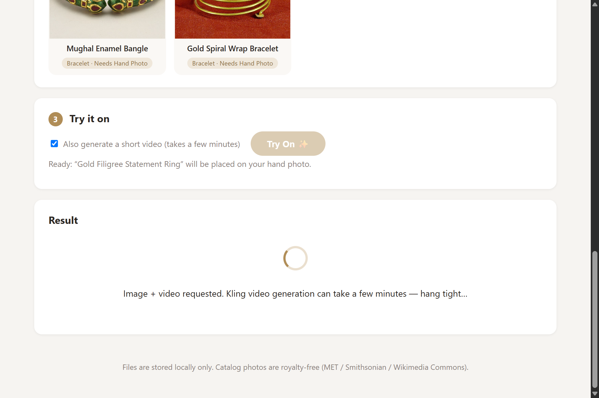
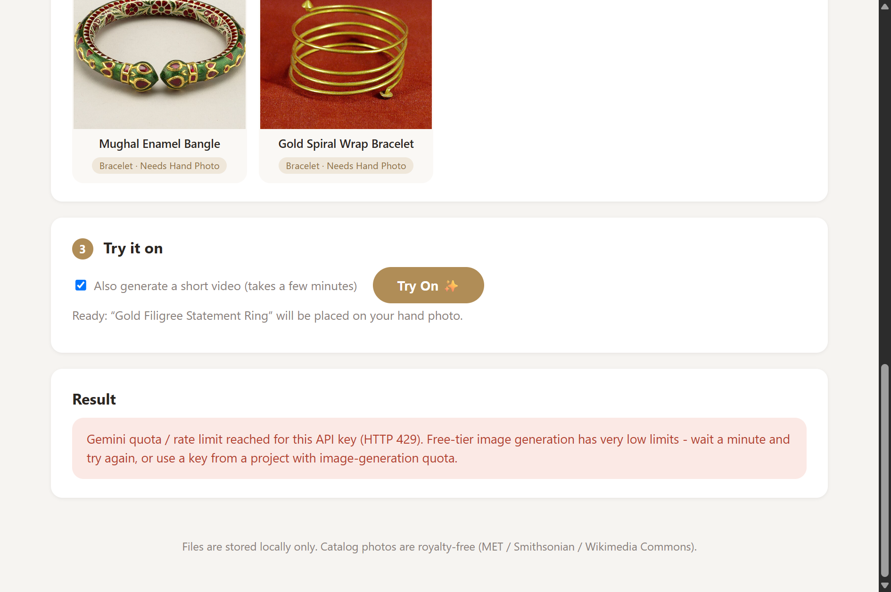

# 💎 Jewelry Virtual Try-On

A virtual try-on system built for the **Sixth Dimension Labs backend intern assignment (Part 1)**.

A user uploads a photo of their **face** (for necklaces / earrings) or their **hand** (for rings / bracelets), picks a jewelry item from a 10-item catalog, and the system:

1. uses the **Google Gemini API** to generate a photorealistic image of them *wearing* the selected piece, and
2. uses the **Kling AI API** to animate that image into a short (~5 s) video,

then displays both in a minimal frontend. All files (uploads, generated images, videos) are stored on the **local filesystem only** — no cloud storage.

> **Part 2 (clothing try-on) was intentionally not attempted** — per the assignment, it is bonus-only and Part 1 was prioritized.

---

## Screenshots

| Home & catalog | Ready to try on |
| --- | --- |
|  |  |

| Loading state | Error handling (graceful API failure) |
| --- | --- |
|  |  |

> **Demo placeholder:** a successful generated try-on image + video will be added here once the
> API keys have active image/video quota (see [Honest status](#honest-status--known-limitations)
> below for exactly what happened during development). The full pipeline — upload → validate →
> prompt build → Gemini call → Kling call → local save → display — is implemented and exercised
> end-to-end by the automated tests with the external APIs mocked.

---

## Tech stack

| Layer | Choice |
| --- | --- |
| Backend | Python, FastAPI, Uvicorn, Pydantic |
| Image try-on | Google Gemini API (`gemini-2.5-flash-image`, REST) |
| Video | Kling AI image-to-video API (`kling-v1`, JWT auth) |
| Image handling | Pillow, httpx |
| Frontend | Plain HTML / CSS / JS (no frameworks) |
| Config | python-dotenv (`.env`) |
| Tests | pytest (28 tests) |

## Project structure

```
backend/
  app.py                  # FastAPI app + routes + upload validation
  config.py               # env-based settings (no hardcoded secrets)
  services/
    prompt_builder.py     # ⭐ type-aware Gemini prompt construction
    gemini_service.py     # Gemini REST call, image-in/image-out
    kling_service.py      # Kling JWT auth, create task, poll, download
  catalog/
    catalog.json          # 10 items: id, name, type, image, description, attribution
    images/               # royalty-free product photos (stored locally)
  uploads/                # user photos land here   (gitignored)
  outputs/                # generated images/videos (gitignored)
frontend/
  index.html  styles.css  app.js
tests/
  test_prompt_builder.py  # prompt generation + jewelry-type mapping
  test_routes.py          # route & response-shape tests (APIs mocked)
scripts/
  fetch_catalog_images.py # how the catalog images were sourced (provenance)
docs/screenshots/
```

---

## How to install and run locally

Requires **Python 3.10+**.

```bash
git clone https://github.com/17mohak/gemini-jewelry-virtual-tryon.git
cd gemini-jewelry-virtual-tryon

python -m venv .venv
# Windows:
.venv\Scripts\activate
# macOS/Linux:
source .venv/bin/activate

pip install -r requirements.txt

# configure keys (see next section)
copy .env.example .env        # Windows  (cp on macOS/Linux)
# ... edit .env and paste your keys ...

uvicorn backend.app:app --port 8000
```

Open **http://127.0.0.1:8000** — the backend serves the frontend, the catalog
images, and the generated outputs from the same port, so nothing else needs to run.

Run the tests with:

```bash
python -m pytest tests/ -v
```

## API keys & environment variables

All secrets are read from environment variables (loaded from `.env`). Nothing is hardcoded.

| Variable | Required | Description |
| --- | --- | --- |
| `GEMINI_API_KEY` | yes | Google Gemini API key |
| `KLING_ACCESS_KEY` | yes (for video) | Kling AccessKey |
| `KLING_SECRET_KEY` | yes (for video) | Kling SecretKey |
| `GEMINI_MODEL` | no | default `gemini-2.5-flash-image` |
| `KLING_MODEL` | no | default `kling-v1` |
| `KLING_API_BASE` | no | default `https://api-singapore.klingai.com` |
| `KLING_VIDEO_DURATION` | no | `5` or `10` seconds (default `5`) |
| `APP_ENV` | no | default `local` |

### Getting a Gemini key (free)

1. Go to [Google AI Studio](https://aistudio.google.com/apikey) and sign in.
2. Click **Create API key** (keys look like `AIza...`).
3. Paste it into `.env` as `GEMINI_API_KEY`.

Vertex AI **Express-mode** keys (they start with `AQ.`) also work — the
`generativelanguage.googleapis.com` endpoint used here accepts both. Note that
**image-generation models have separate (much lower) free-tier quota than text
models** — see [Honest status](#honest-status--known-limitations).

### Getting Kling keys (free trial)

1. Register at the [Kling AI developer console](https://app.klingai.com) (API / open-platform section).
2. Create an application to obtain an **AccessKey + SecretKey** pair and activate the trial resource package.
3. Paste both into `.env`. The backend signs a short-lived HS256 JWT from them for every request — the raw keys are never sent.

## Backend API

| Method | Path | Description |
| --- | --- | --- |
| `GET` | `/api/health` | health + config check |
| `GET` | `/api/catalog` | catalog items (id, name, type, description, image URL, required photo kind) |
| `POST` | `/api/tryon` | multipart form: `item_id`, `face_photo` and/or `hand_photo`, `generate_video` |
| `GET` | `/outputs/{file}` | generated images / videos |
| `GET` | `/catalog/images/{file}` | catalog product photos |

`POST /api/tryon` picks the correct uploaded photo **server-side** based on the
item's type (necklace/earrings → face, ring/bracelet → hand), validates it
(type, size ≤ 8 MB, decodable image, EXIF orientation normalized), calls Gemini,
saves the result, then calls Kling. **A Kling failure does not void the image
result** — the response still returns `image_url`, plus a human-readable
`video_error`. The response also includes the exact `prompt` that was sent to
Gemini (the frontend shows it behind a "Show the Gemini prompt used" toggle, so
prompt quality can be inspected per item).

---

## Gemini prompt design (the important part)

The prompt is **built by code** in
[`backend/services/prompt_builder.py`](backend/services/prompt_builder.py) —
there is no static prompt string. For every request it assembles six sections:

1. **Role + image naming.** The model is addressed as a *professional photo
   retoucher* doing a try-on edit, and the two attached images are explicitly
   named ("Image 1 = the person's face/hand photo, Image 2 = the product
   photo"). Naming the images removes the most common failure mode of
   multi-image editing: the model swapping the roles of the inputs.
2. **Product anchor.** The catalog item's *name, type and visual description*
   (materials, stones, colors) are injected verbatim, so the model anchors on
   the actual product instead of hallucinating a generic "gold necklace".
   Items whose product photo contains extras carry a per-item `prompt_hint`
   (e.g. the wedding-rings photo: *"apply ONLY the three-stone ring, ignore the
   plain band"*; the single hoop: *"render as a matching pair"*).
3. **Type-aware placement physics.** Each jewelry type gets placement language
   written the way a photographer would direct it — necklaces *drape with
   gravity and rest on the collarbones*, earrings *hang from both lobes and
   follow head tilt*, rings *wrap the ring finger between knuckle and base
   joint*, bracelets *wrap the wrist and rest against the wrist bone*. Asking
   for occlusion ("let hair/fingers hide parts of it") and *contact shadows* is
   what kills the pasted-on-sticker look.
4. **Identity preservation.** A strict list of what must NOT change, phrased
   per photo kind: facial identity, expression, skin tone & texture, hairstyle,
   clothing, pose, background, framing, lighting direction, white balance and
   image style for face photos; hand structure, finger positions, nails, etc.
   for hand photos. "The ONLY change allowed is the addition of the jewelry."
5. **Jewelry fidelity.** Shape / silhouette / material / color / gemstone
   count must be identical; only the *lighting* on the jewelry may adapt to the
   scene. This separates "re-light it" (wanted) from "redesign it" (forbidden).
6. **Hard rules.** An explicit reject-list: photorealistic only, no pasted-on
   effect, no distortion, no identity change, no background drift, no
   style-transfer artifacts, no extra accessories or watermarks, single output
   image at the same framing.

**Why this structure:** image-editing models follow *concrete, physical,
testable* instructions far better than adjectives. "Drapes with gravity and
rests on the collarbones, with soft contact shadows" gives the model something
to render; "make it look natural" does not. Putting the constraints in a
labeled, rule-shaped block ("the result is rejected if…") also measurably
reduces constraint-dropping on long prompts.

The **photo-routing logic** (necklace/earrings → face photo, ring/bracelet →
hand photo) lives in the same module (`required_photo_kind()`) and is enforced
in three places: the catalog API (so the UI can badge each item), the frontend
(button stays disabled until the right photo is uploaded), and the backend
route (server-side validation with a clear 400 if the wrong photo is sent).

A separate, much simpler `build_video_prompt()` drives Kling: since the try-on
image is the first frame, the video prompt only requests *subtle motion* (a
slow head turn / hand rotation so light glints off the piece) and explicitly
forbids morphing, warping or scene changes.

## Video generation (Kling)

`backend/services/kling_service.py` implements the documented Kling open-API
flow: sign a 30-minute HS256 JWT from AccessKey/SecretKey → `POST
/v1/videos/image2video` with the try-on image (base64) and motion prompt →
poll `GET /v1/videos/image2video/{task_id}` every 10 s (up to 8 min) → download
the MP4 into `backend/outputs/`. Errors at any stage map to clean,
human-readable messages (auth not active, out of credits, task failed, timeout).

---

## Honest status / known limitations

The assignment asks for honesty about what works and what doesn't, so:

**What is verified working end-to-end:**
- Backend, catalog, uploads, validation, type-aware routing, prompt building,
  file storage, frontend flow (upload → select → try on → loading → result/error),
  structured logging, and all 28 tests.
- The Gemini integration itself: the request/response code was verified against
  the live API (a Gemini **text** model call succeeds with the same key and code
  path, and the image call reaches Google and returns Google's quota response).

**What was blocked by API-side quota during development (not by code):**

- **Gemini image generation** — the key available during development returned
  HTTP 429 with `limit: 0` for *every* image-capable model
  (`generativelanguage.googleapis.com/generate_content_free_tier_requests,
  limit: 0, model: gemini-2.5-flash-image`). That project simply has **no
  free-tier image-generation quota** (text quota works fine). The app surfaces
  this as a clean, friendly error (screenshot above).
  **Workaround:** use an AI Studio key from a project with image quota — no
  code changes needed; the model can also be switched via `GEMINI_MODEL`.
- **Kling video** — the trial AccessKey/SecretKey pair returned
  `code 1003: "Authorization is not active"` from both `api.klingai.com` and
  `api-singapore.klingai.com`, meaning the keys exist but no API resource
  package / trial has been activated for them in the Kling console. The JWT
  signing itself follows Kling's documented scheme. The app degrades
  gracefully: the try-on image is still returned, with the video error shown
  as a warning. **Workaround:** activate the free trial package in the Kling
  console; or point `KLING_API_BASE`/`KLING_MODEL` at another account/region.

Both failure modes are *displayed in the UI* rather than crashing anything,
and both integrations are covered by mocked tests that pin the exact
request/response contracts.

## Catalog & image credits

The 10 catalog items (4 necklaces, 2 earrings, 2 rings, 2 bracelets) use
royalty-free product photos sourced from Wikimedia Commons — primarily The
Metropolitan Museum of Art's **CC0** open-access collection plus
public-domain Cooper Hewitt / Smithsonian and Musée de Cluny photographs.
Each item's `attribution` block in
[`backend/catalog/catalog.json`](backend/catalog/catalog.json) holds the exact
source URL and license; the one CC-BY item (Three-Stone Diamond Ring, photo by
*Litho Printers*, CC BY 2.0) is credited there as required. The download
script used for sourcing is kept in `scripts/fetch_catalog_images.py`.
