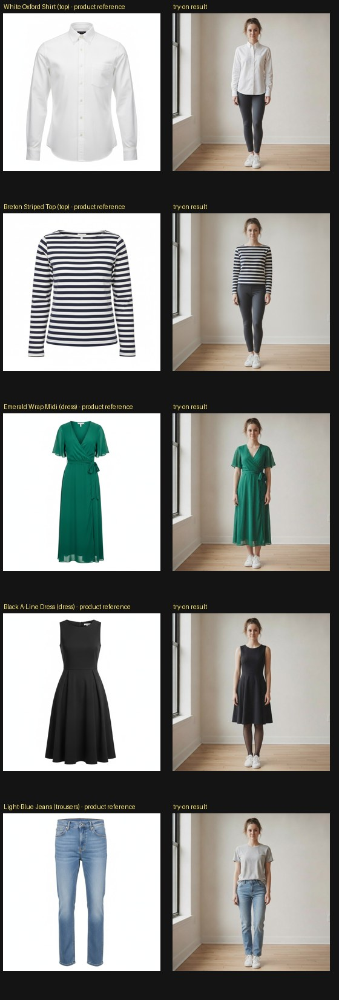
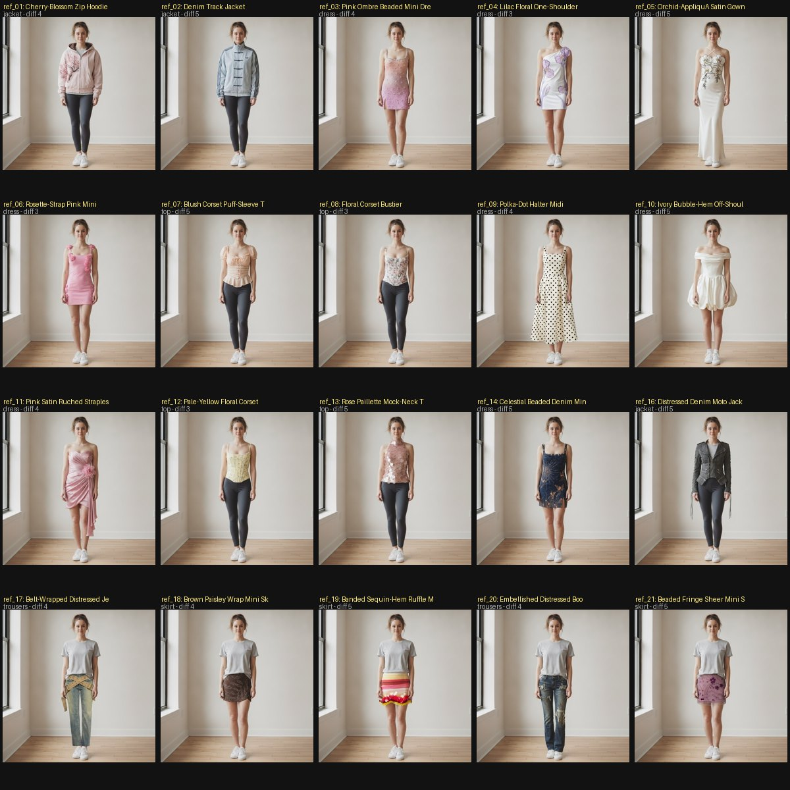
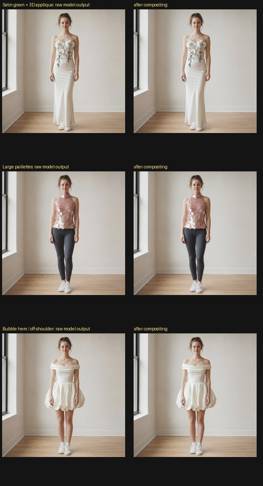

# Apparel Virtual Try-On — Engineering Case Study

**Project:** Jewelry & Clothing Virtual Try-On · **Subject of this report:** the
clothing / apparel pipeline · **Model backbone:** Nano Banana
(`gemini-3.1-flash-image`) · **Document type:** technical design / engineering
case study.

> This is a development case study, not a user manual. It documents the
> engineering process that took the apparel try-on pipeline from a single
> prompt-and-generate call to a measured, compositing-based pipeline, and is
> deliberately honest about what was and was not achieved.

---

## 1. Introduction

The goal of the apparel pipeline is to take **one full-body photograph of a
person** and **one product photograph of a garment**, and produce a photograph
of that same person wearing that garment — convincingly enough to survive a
close look.

Apparel try-on is hard for reasons that compound: garments must **deform** to
wrap a 3-D body with correct drape, folds and hem placement for *this* pose; a
swap is **destructive** (putting on a dress removes what was there, so the model
must decide what is covered and not erase legs or footwear); **materials carry
the realism** (satin sheen, sequin speculars, sheer transparency and embroidery
are the cues a human reads first); and **the rest of the photo must not change**
— face, hair, background and grain belong to the original photograph, and any
drift there reads as fake.

The effort described here treats photorealism as something to be *measured and
defended*, not asserted — each change was driven by an observed failure and kept
only if it produced a measurable, regression-free improvement.

---

## 2. Initial State

The first implementation was a single-shot pipeline: assemble a text prompt,
send `(user photo, product photo, prompt)` to the image model, and return the
result directly. It worked, but a structured review of its outputs surfaced
several classes of problem:

| Area | Observed shortcoming |
| --- | --- |
| Garment geometry | Hems drifted longer than the product — a *midi* dress rendered floor-length and **erased the wearer's legs**. |
| Coverage | The visible-skin contract was implicit; the model would extend fabric over areas the garment does not actually cover. |
| Identity | Faces were subtly re-drawn on every edit (a full-frame re-synthesis side effect) — "almost the same person." |
| Background | Walls, floor and footwear were re-rendered rather than preserved. |
| Lighting / grain | The garment was rendered with clean studio shading while the photo had its own flash falloff and sensor noise ("AI gloss"). |
| Taxonomy | Only `top / dress / trousers` were modelled. Skirts, outerwear and two-piece sets had no correct representation. |
| Prompting | Generic "reproduce the pattern" language said nothing about *materials*; sequins, satin and sheer fabric were under-specified. |
| Evaluation | Quality was judged by eye, ad hoc — there was no benchmark, no metric, no regression guard. |

The two most damaging defects — hem drift with leg erasure, and identity /
background drift — motivated the rest of the work.

---

## 3. Engineering Improvements

Work proceeded in four overlapping streams: **prompt engineering**, **apparel
taxonomy**, a **compositing pipeline**, and **evaluation infrastructure**. The
order below is roughly chronological.

### 3.1 Prompt engineering

The prompt is assembled in code per request
([`clothing_prompt_builder.py`](../backend/services/clothing_prompt_builder.py)),
never as a static string, so each section adapts to the garment. The key changes:

- **Body-landmark hem constraints.** The original loophole ("…unless the garment
  naturally covers them") was removed and replaced with explicit hem anchoring
  (knee / mid-calf / ankle) measured against body landmarks, plus a hard rule
  that the hem ends where the *product's* hem ends — never lower.
- **Visible-skin conservation.** An explicit contract: any skin visible in the
  input that the garment's real cut does not cover must remain visible. This
  directly attacks leg/arm/neckline erasure.
- **Photographic-character section.** The prompt now names the input's flash
  type, white balance, sensor noise and sharpness, and requires the new fabric
  to inherit them — countering the clean-studio-shading "AI gloss".
- **Structured catalog metadata.** Each catalog garment carries a `coverage`
  field (what it covers / what stays visible), injected as a hard geometry
  constraint; descriptions were tightened where they conflicted with the product
  photo (a real example: a gold-hoop description said "thick" while the photo
  showed a slender hoop — corrected after the catalog sweep flagged it).
- **Material-aware prompting (keyword-triggered).** The most apparel-specific
  change. The builder scans the garment's name/description/materials/construction
  and appends *targeted* physics only when relevant — e.g. *"each sequin is a
  tiny mirror reflecting the same scene lights"* for paillettes, *"the skin
  behind it stays visible through the fabric"* for sheer mesh, anisotropic-sheen
  language for satin, weave language for denim. Plain garments match no keywords
  and get no extra text, so simple items do not regress.

### 3.2 Apparel taxonomy

The original three-type taxonomy could only *mis-map* the harder garments. The
taxonomy was expanded and given a **layering mode**:

| Added type | Why it mattered |
| --- | --- |
| `skirt` | A skirt routed through `trousers` grew trouser legs over bare legs. The `skirt` fit keeps the legs below the hem bare and explicitly forbids rendering trouser legs. |
| `jacket` (+ `layer: "over"`) | Outerwear is **worn over** the existing clothing, not swapped for it. The layering instruction preserves the garment underneath and lets it show at the open front, collar and cuffs — so a jacket no longer deletes the tee. |
| `set` | A two-piece (e.g. crop top + skirt) is fitted as two coordinated pieces with the bare midriff between them preserved, rather than being fused into one dress. |

Each type carries its own fit physics (how it sits, where the hem lands, what
stays visible), so routing a garment to the correct type changes its geometry,
not just its label.

### 3.3 Compositing pipeline

The decisive realism insight was **architectural**: the image model
re-synthesizes *every pixel* of the frame on every edit. Even with a perfect
prompt, "untouched" regions are re-rendered — measured at roughly **12–19% loss
of micro-texture** on background walls and faces in the diagnostic audit. No
prompt can fix this, because the model has no mechanism to return the original
pixels.

The fix is a post-process
([`compositing.py`](../backend/services/compositing.py), numpy + scipy + Pillow,
no new model and no GPU): **keep the model's edit only where the image actually
changed, and restore the original photograph everywhere else.** Because the
output is aspect-pinned to the input, the two are already pixel-registered
(median per-pixel difference ≈ 2, the JPEG-recompression floor), so a difference
mask isolates the edit cleanly.

| Stage | Purpose |
| --- | --- |
| Tone harmonization | Fit a per-channel gain+bias on the unchanged majority of pixels to neutralize the model's global exposure / white-balance drift. |
| Two-cue change mask | `CIELAB ΔE` **OR** local-texture change → de-speckle → fill holes → dilate (the dilation deliberately keeps the garment's own contact shadow). The texture cue catches edits whose colour resembles what they replaced. |
| Feather + grain match | Soft alpha boundary; re-inject sensor noise into the denoised edit region to match the surrounding photo's grain. |
| Alpha composite | `original·(1−α) + harmonized·α`. |
| Safety valves | Bail to the raw model output when the mask is empty, covers > 75 % of the frame, the aspect ratio changed, or the background **structurally drifted** (a within-aspect reframe). |

**Identity, background and footwear are preserved by construction** — they lie
outside the mask, so their pixels are literally the original upload. The
following figure shows the effect on a garment swap: the difference map for the
raw model output lights up across the whole person, while the composite changes
only the dress region.

*Figure 1 — Pixel-preserving compositing on the wrap-dress swap. The right-most
panel (input vs composite) is dark everywhere except the garment, confirming the
face, hair and background are the original pixels.*

### 3.4 Evaluation infrastructure

Measuring improvements was treated as a first-class deliverable, because most
apparel-realism changes are easy to *believe* and hard to *verify*. Four
Pillow/numpy harnesses were built (none spend the paid video budget):

- **Golden benchmark** ([`run_eval.py`](../eval/run_eval.py)) — pairs every
  catalog item with a fixed synthetic input and scores aspect drift, background
  preservation, noise/sharpness parity, brightness drift and lower-body
  skin conservation, writing a report with a human-rubric column.
- **Adversarial stress harness** ([`stress_eval.py`](../eval/stress_eval.py)) —
  runs the hard garment set end-to-end and emits comparison + difference panels.
- **Offline compositing A/B** ([`compositing_eval.py`](../eval/compositing_eval.py))
  — runs the compositor on already-generated outputs and tabulates the
  before/after metric deltas (no model calls).
- **Edit-region-aware metrics** ([`metrics.py`](../eval/metrics.py)) — including
  `preserved_region_parity()`, which measures grain/sharpness parity **only off
  the edit region**. This fixed a real blind spot: global parity over-flags
  patterned garments (a striped top legitimately adds edge energy), whereas the
  masked metric isolates whether the *untouched* photo was disturbed.

### 3.5 Engineering decisions: techniques investigated and rejected

Several plausible ideas were implemented as experiments and then **removed**
because they failed the bar of *measurable + visual + no-regression*:

| Technique | Why it was rejected |
| --- | --- |
| Strengthened "integration" prompt (forceful contact-shadow / exposure language) | Marginal tonal gain, and it induced a garment-scale regression. Net negative. |
| Deterministic contact-shadow / ambient-occlusion synthesis | Subtle and fragile; depended on a guessed light direction, so it risked adding wrong shadows. |
| Model self-refinement second pass ("add the contact shadows") | The added shadow was within ±1 luma of noise — i.e. no measurable effect — at twice the quota. |
| Switching clothing to the higher-tier `gemini-3-pro-image` | On the hardest garments the visual gain over the flash model was marginal at 400 % zoom, and the sheer-fabric limitation persisted in both. The flash model is already near its ceiling for clothing; the default stays flash. |

Documenting these is deliberate: the discipline of deleting weak ideas is part
of the engineering record.

---

## 4. Apparel Evaluation

Two garment sets were used. The **catalog** (5 garments, project-owned product
images) is the shipped product surface. The **adversarial stress set** (21
garments) was assembled specifically to break the pipeline with materials and
constructions the catalog never exercises.

> **Note on the reference images.** The 21 adversarial reference photos are
> third-party product photographs and are **not redistributed** with the
> project; they are therefore omitted from the figures below, which show the
> system's own *generated* outputs. Each garment is fully described in
> [`eval/stress_manifest.json`](../eval/stress_manifest.json), and the benchmark
> is reproducible locally per [`eval/stress/refs/README.md`](../eval/stress/refs/README.md).

### 4.1 Catalog garments — product reference vs result

*Figure 2 — The five catalog garments. Pattern (Breton stripes), cut (Oxford
collar/placket), hem length (knee-length A-line, true-length wrap midi) and
lower-body-only swap (jeans, with the top untouched) are all reproduced; the
person's identity and the room are preserved.*

### 4.2 Adversarial stress set — generated composites

*Figure 3 — Twenty of the 21 adversarial garments (the 21st is discussed below),
each a real try-on composite on the same person: structured jackets, sequins,
satin, beaded denim, corsets, bubble hems, asymmetric one-shoulder cuts, and
skirts. Identity and background are preserved across all of them.*

### 4.3 Compositing on hard garments

*Figure 4 — Raw model output (left) vs final composite (right) for a satin
appliqué gown, a large-paillette top, and a bubble-hem off-shoulder dress. The
composite restores the surrounding photograph while keeping the model's garment
render.*

### 4.4 Per-garment outcomes (full adversarial set)

| ID | Garment | Type | Diff. | Primary stress | Outcome |
| --- | --- | --- | --- | --- | --- |
| ref_01 | Cherry-Blossom Zip Hoodie | jacket | 4 | layering + embroidery | Layered over tee; embroidery reproduced |
| ref_02 | Denim Track Jacket | jacket | 5 | logo/stripes + layering | Stripes + trefoil legible; worn over tee |
| ref_03 | Pink Ombré Beaded Mini | dress | 4 | bead speculars + gradient | Beads as speculars; gradient held |
| ref_04 | Lilac Floral One-Shoulder | dress | 3 | asymmetry | One-shoulder asymmetry preserved |
| ref_05 | Orchid-Appliqué Satin Gown | dress | 5 | satin + 3D appliqué + floor hem | 3D orchids + sheen; feet preserved |
| ref_06 | Rosette-Strap Pink Mini | dress | 3 | 3D appliqué | Rosettes rendered with volume |
| ref_07 | Blush Corset Puff-Sleeve Top | top | 5 | sheer sleeves + boning + peplum | Structure good; sheer under-rendered |
| ref_08 | Floral Corset Bustier | top | 3 | boning + small print | Faithful |
| ref_09 | Polka-Dot Halter Midi | dress | 4 | regular pattern under deformation | Dots even over contours; hem held |
| ref_10 | Ivory Bubble-Hem Off-Shoulder | dress | 5 | non-body volume + bare shoulders | Bubble volume + bare shoulders correct |
| ref_11 | Pink Satin Ruched Strapless | dress | 4 | satin drape + strapless | Sheen + ruching; shoulders bare |
| ref_12 | Pale-Yellow Floral Corset | top | 3 | boning + print | Faithful |
| ref_13 | Rose Paillette Mock-Neck Top | top | 5 | large specular discs | Individual paillettes, not flat glitter |
| ref_14 | Celestial Beaded Denim Mini | dress | 5 | figurative metallic embroidery | Beadwork present; motif loose |
| ref_15 | Grommet Asymmetric Two-Piece | set | 5 | revealing cut-out | **Model refusal (IMAGE_SAFETY)** |
| ref_16 | Distressed Denim Moto Jacket | jacket | 5 | structure + laces + layering | Structure + dangling laces; over tee |
| ref_17 | Belt-Wrapped Distressed Jeans | trousers | 4 | deconstruction | Wash/distress held; top untouched |
| ref_18 | Brown Paisley Wrap Mini Skirt | skirt | 4 | skirt taxonomy + drape | Legs bare below hem; tee preserved |
| ref_19 | Banded Sequin-Hem Ruffle Skirt | skirt | 5 | banded colour + sequins + chiffon | Band order + sequin hem held |
| ref_20 | Embellished Distressed Bootcut | trousers | 4 | distress + studs | Distress/wash reproduced |
| ref_21 | Beaded Fringe Sheer Mini Skirt | skirt | 5 | sheer mesh + 3D beads + fringe | Beadwork + fringe; sheerness partial |

### 4.5 Findings

- **Largest improvements came from taxonomy and layering.** Skirts
  (ref_18/19/21) and outerwear (ref_01/02/16) are categories the original
  pipeline could not represent at all; with the expanded taxonomy they render
  correctly — legs bare below a skirt hem, the existing top preserved under an
  open jacket. These were structural wins, not tuning.
- **Material-aware prompting measurably helped specular embellishment.** Large
  paillettes (ref_13) render as individual discs rather than flat glitter, and
  satin (ref_05/11) shows directional sheen.
- **Structured / non-body silhouettes** such as the bubble hem (ref_10) and
  corsets (ref_07/08/12) hold their shape.
- **The hardest, still-imperfect cases are material-physics limits:** sheer
  fabric (ref_07/21) renders semi-opaque, and fine figurative embroidery
  (ref_14) is reproduced loosely. One garment (ref_15) was refused outright by
  the model's content filter.

---

## 5. Jewelry Improvements (concise)

Although this report centres on apparel, the same engineering methods were
applied to jewelry (necklaces, earrings, rings, bracelets):

- **Prompt refinement** — per-type placement physics (drape to the collarbones,
  attach at the lobe, wrap the finger's cylinder) and explicit contact-shadow /
  occlusion language.
- **Scale anchors** — physical-size guidance (e.g. pendant 2–3 cm) to curb the
  model's tendency to oversize statement pieces.
- **Occlusion handling** — strict, conservative earring rules: never invent a
  hidden ear; a missing earring on a fully covered ear is correct behaviour.
- **Compositing + benchmarking** — the same pixel-preserving stage and metrics
  apply, so the face outside the jewelry is the original photograph.

The jewelry-specific honest finding, established by an A/B re-audit, is that the
remaining "slightly studio-lit / floating" look is an **edit-region rendering
limit of the model**: three separate attempts to add contact-shadow grounding
(prompt, deterministic synthesis, model self-refinement) produced no measurable,
regression-free gain. The higher-tier `gemini-3-pro-image` does improve jewelry
grounding, but it occasionally reframes the shot, so it is offered as an opt-in
behind the framing guards rather than as the default.

---

## 6. Results

Measured outcomes (full detail in
[`eval/BENCHMARK_RESULTS.md`](../eval/BENCHMARK_RESULTS.md) and
[`eval/REALISM_AUDIT.md`](../eval/REALISM_AUDIT.md)):

| Dimension | Result |
| --- | --- |
| Background preservation | Border-strip drift falls from ~2.0 to ~0.15 after compositing (the rest of the photo is the original). |
| Identity / footwear | Preserved by construction (outside the change mask); face no longer re-drawn. |
| Localized editing | Edit region is the garment + its contact shadow only; everything else is byte-for-byte original. |
| Garment geometry | Hem-drift and leg-erasure failures fixed and benchmark-verified; lower-body skin conserved across all clothing cases. |
| Layering | Outerwear correctly worn over existing clothing; skirts keep legs bare. |
| Evaluation honesty | `preserved_region_parity` removes the patterned-garment false positive (e.g. a striped top: global noise/sharpness 1.38/1.42 → preserved-region 0.98/0.98). |
| Catalog coverage | Full 15-case catalog sweep generated and human-reviewed with no hard failures; adversarial set 20/21 generated. |

The headline result is qualitative but well-supported: the output is now
demonstrably *a photograph of the input person* outside a tight, grounded edit
region, rather than a full re-synthesis of the scene.

---

## 7. Remaining Limitations

The distinction between pipeline and model limits is kept deliberately sharp.

**Pipeline limitations (addressable here):**

- Sheer-fabric transparency is not *post-processed*; the pipeline relies on the
  model to render see-through fabric and does not composite skin-through-mesh
  explicitly.
- The compositor has no depth model, so it cannot reorder hair over jewelry or
  synthesize geometry-aware contact shadows.
- The adversarial benchmark depends on user-sourced reference images (by design,
  for licensing).

**Underlying model limitations (not reachable by this pipeline):**

- **Edit-region micro-illumination** — contact shadows, light falloff and
  environmental colour bleed on inserted objects are under-modelled; this is the
  dominant "synthetic" tell and was shown to be prompt-insensitive.
- **Sheer transparency** renders semi-opaque regardless of instruction.
- **Fine figurative embroidery / logos** are approximated, not reproduced.
- **Invented under-layers (FM-E)** — when a swap removes coverage the product
  does not replace (e.g. knee-length dress over full-length leggings), the model
  invents a plausible filler (sheer tights, socks); documented, not hard-coded.
- **Content-policy refusals** on revealing garments (ref_15).

---

## 8. Future Work

Realistic next directions, roughly in order of expected return on effort:

1. **Higher-tier model behind the framing guards.** Adopt `gemini-3-pro-image`
   as the renderer, converting the current reframe *bail* into a *retry* with a
   tightened framing instruction (or a flash fallback). This captures the
   measured edit-region gain without losing framing fidelity.
2. **Segmentation-assisted compositing.** Person/garment and hair mattes (SAM /
   rembg-class) would make the change mask exact and enable hair re-occlusion
   over jewelry and necklines.
3. **Explicit transparency compositing.** For sheer garments, blend the rendered
   fabric with the original skin behind it at a measured opacity, rather than
   relying on the model.
4. **Geometry-aware relighting / contact-shadow synthesis** using an estimated
   light direction and a coarse depth/normal prior — the principled version of
   the heuristic that was rejected for being direction-blind.
5. **Hybrid / local inference for clothing.** Warping-based VTON models
   (IDM-VTON / CatVTON class) preserve everything outside the garment by
   construction and model fabric warping explicitly; the trade-off is GPU
   serving and integration effort. This is the path to "indistinguishable" if
   the single-model ceiling proves too low.

---

*Appendix — the application UI (clothing mode), for context:*

